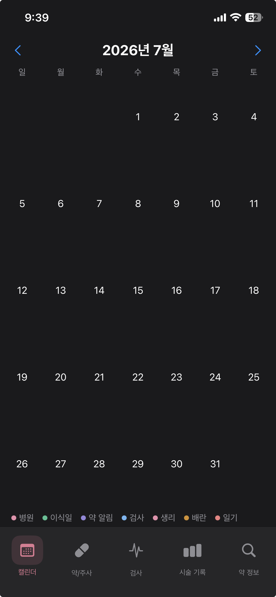
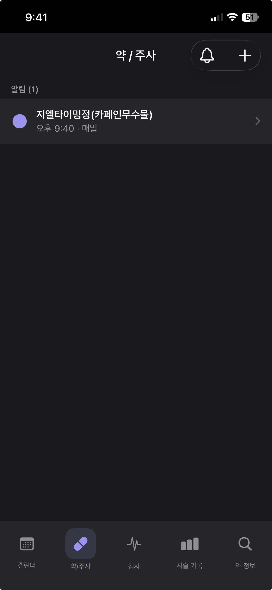
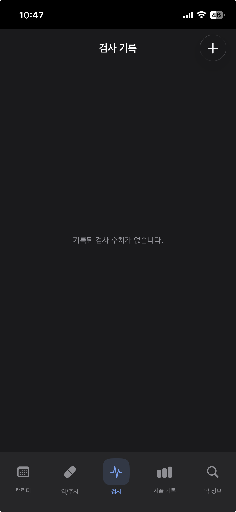
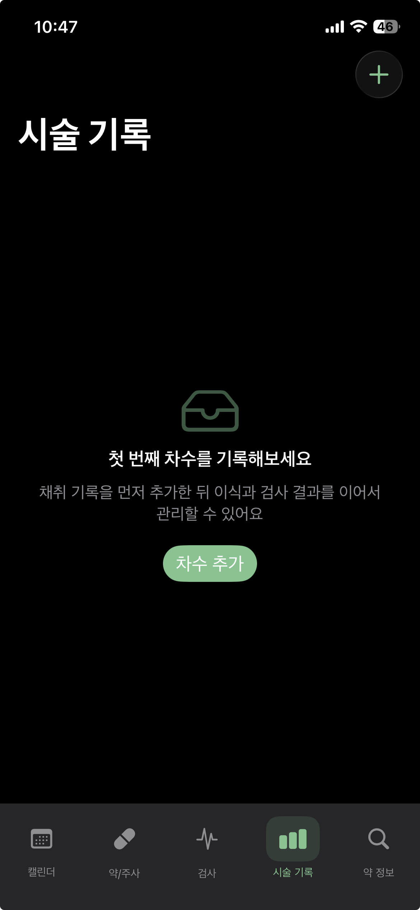
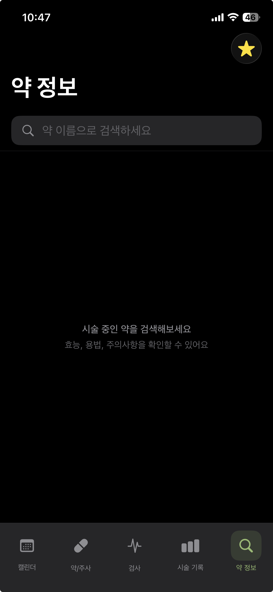

# 🌸 아란 (Aran)

[](https://github.com/UiHyungZo/Aran/actions/workflows/ci.yml)
[](https://github.com/UiHyungZo/Aran/actions/workflows/cd.yml)

> 시험관 시술(IVF)을 진행 중인 여성을 위한 통합 관리 iOS 앱

<br>

## 📱 Preview

|               캘린더               |                약/주사               |              검사             |           시술 기록           |             약 정보            |
| :-----------------------------: | :-------------------------------: | :-------------------------: | :-------------------------: | :-------------------------: |
|  |  |  |  |  |

<br>

## 📌 프로젝트 소개

시험관 시술 중인 사용자는 복용 약 시간 관리, 병원 일정 관리, 채취/이식 기록, 검사 수치 추적, 감정 기록 등을 여러 앱과 메모에 분산 관리하는 경우가 많습니다.

**아란(Aran)** 은 이러한 흐름을 하나의 캘린더 중심 구조로 통합한 iOS 포트폴리오 앱입니다.

<br>

## 🧩 프로젝트 정보

| 항목 | 내용 |
|------|------|
| 개발 + 기획 기간 | 약 4주 |
| 개발 인원 | 1인 iOS 개발 |
| 플랫폼 | iOS 17+ |
| 언어 | Swift 6 |
| 아키텍처 | Clean Architecture + MVVM |
| UI | SwiftUI + Combine / UIKit + RxSwift |
| 데이터 | SwiftData |
| 테스트 | Unit Test 중심 / UI Test Phase 2 |

<br>

## ✨ 주요 기능

### 📅 캘린더
- 월간 캘린더 기반 날짜별 도트 표시 (병원 · 이식일 · 약 알림 · 검사 · 생리 · 배란 · 일기)
- 2단계 바텀시트 — 날짜 요약 → 항목별 입력/수정
- 병원 일정 / 감정 일기 / 검사 수치 / 생리 주기 2단계 시트 입력
- 1단계 시트 복용 약 체크박스 (MedicationLog SwiftData 저장)

### 💊 약 / 주사
- 복용 약 등록 및 관리 (UITableView)
- 복용 시간별 알림 설정 (MedicationSchedule 단위 notificationId 관리)
- 알림 미리보기 및 개별 ON/OFF
- 스와이프 액션 (중단 / 삭제)
- DrugSearch register 모드 자동 입력 + 직접 입력 fallback

### 🏥 검사
- FSH / AMH / AFC / E2 / P4 / LH / β-hCG 수치 기록 (기본 7개 + 커스텀 항목 직접 추가)
- 항목별 최신 수치 증감 TrendBadge (↑↓)
- 항목별 히스토리 조회
- Swift Charts Line Chart — 수치 변화 + 정상 범위 레퍼런스 라인

### 🗂 시술 기록
- 차수별 카드 (채취/수정/동결 개수, 이식 결과 요약, 진행중/성공/실패 배지)
- 차수 상세 화면 (채취 → 수정 → 동결 → 이식 → PGT 한눈에)
- PGT / 염색체 / 반착검사 기록
- Swift Charts Bar Chart — 차수별 흐름 시각화

### 🔍 약 정보
- e약은요 OpenAPI 기반 약 검색 (Combine .debounce 0.3s)
- 전문의약품 API fallback (DrugApprovalAPIClient)
- 효능 / 용법 / 주의사항 상세 조회
- 즐겨찾기 (FavoriteDrug 전체 스택)
- 최근 검색어 SwiftData 저장
- 약 등록 화면 연동 (`이 약 추가하기` → MedicationFormVC)

<br>

## 🏗 Architecture

```
Presentation Layer
├── SwiftUI + Combine          ← Calendar, ProcedureRecord, DrugInfo
└── UIKit + RxSwift            ← Medication, HealthRecord (Exam)
            ↓
Domain Layer
├── UseCase                    ← 순수 비즈니스 로직
├── Entity                     ← 순수 Swift 타입
└── Repository Protocol        ← 추상화 경계
            ↓
Data Layer
├── SwiftData                  ← 로컬 영속성
├── Alamofire                  ← 외부 API
├── UserNotifications          ← 알림 관리
└── Repository Implementation  ← Mapper 통해 Entity 변환
```

**의존성 방향:** `Presentation → Domain ← Data` (단방향)

**DIContainer:** Scene 단위 분리 — `CalendarSceneDIContainer`, `MedicationSceneDIContainer`, `HealthRecordSceneDIContainer`, `DrugInfoSceneDIContainer`, `ProcedureRecordSceneDIContainer`

<br>

## 🔥 Technical Challenges

### 1. DrugSearch 컴포넌트 재사용 설계

약 검색 기능은 탭마다 사용 목적이 다릅니다.

- **약 정보 탭**: `browse` — 상세 조회
- **약/주사 탭**: `register` — 약 등록 폼 자동 입력

중복 화면 없이 `DrugSearchMode` enum으로 동작을 분기했습니다.

```swift
enum DrugSearchMode {
    case browse
    case register
}
```

→ UI / API 로직 재사용, 플로우 분기 최소화

---

### 2. SwiftUI + UIKit 브릿지 구성

탭별로 다른 UI 스택을 사용하면서 Coordinator 패턴을 연결하기 위해:

- `UIHostingController` — SwiftUI 뷰를 UIKit 컨텍스트에 삽입
- `UIViewControllerRepresentable` — UIKit VC를 SwiftUI에 노출
- `MedicationListWrapper` / `MedicationFormSheet` / `ExamListWrapper`

```
SwiftUI MainTabView
└── MedicationListWrapper (UIViewControllerRepresentable)
    └── UINavigationController
        └── MedicationListViewController
```

---

### 3. MedicationSchedule 1:N 분리 설계

시간별 알림 ON/OFF 상태, notificationId 관리, 특정 시간만 수정/삭제 요구사항이 생기며 Entity를 분리했습니다.

```
Medication (1)
└── MedicationSchedule (N)   ← notificationId, isEnabled 보유
```

→ 알림 수정 로직 단순화, 시간 단위 상태 관리, UserNotifications 안정화

---

### 4. Swift 6 Concurrency 대응

RxSwift 연동 과정에서 Swift 6 Sendable warning 발생 시:

```swift
@MainActor
final class MedicationViewModel: ObservableObject { }

@preconcurrency import RxSwift
@preconcurrency import RxCocoa
```

무분별한 warning suppression 대신 UI 계층에만 `@MainActor` 적용, RxSwift import만 제한적으로 완화하는 점진적 대응 방식을 선택했습니다.

---

### 5. 전문의약품 API Fallback

전문의약품 API에 검색되지 않는 전문의약품은 e약은요 API 처리 이중 API 구조를 구성했습니다.

```
검색 요청
→ 전문의약품 허가정보 API (DrugApprovalAPIClient) — primary   
  ├── 결과 있음 → 목록 표시 
  └── 결과 없음 → e약은요 API (DrugAPIClient) — fallback 
```

---

### 6. 캘린더 2단계 바텀시트 상태 관리

날짜 선택 → 1단계 요약 → 2단계 입력/수정 플로우에서 1단계 시트가 뒤에 흐리게 유지되어야 합니다.

SwiftUI의 선언형 상태 기반으로 `@State` + presentation detent 조합으로 시트 스택을 구성하고, CalendarViewModel이 모든 섹션 데이터를 날짜 기반으로 통합 관리합니다.

<br>

## 🧪 Test Strategy

비즈니스 로직은 UseCase 단위로 분리하고 MockRepository 기반 TDD를 진행했습니다.

| 레이어 | 테스트 대상 |
|--------|------------|
| UseCase | MedicationUseCase, HealthRecordUseCase, CycleRecordUseCase, SearchDrugUseCase, MedicationNotificationUseCase, TransferRecordUseCase, FavoriteDrugUseCase, MedicationLogUseCase, MenstrualCycleUseCase, PGTRecordUseCase, DiaryEntryUseCase, HospitalVisitUseCase, RecentDrugSearch |
| ViewModel | CalendarViewModel, DrugInfoViewModel, ExamHistoryViewModel, HealthRecordFormViewModel, HealthRecordViewModel, MedicationViewModel, MedicationFormViewModel, ProcedureRecordViewModel |
| Repository | CycleRecordRepository, TransferRecordRepository, FavoriteDrugRepository, DiaryEntry, Drug, HealthRecord, HospitalVisit, MedicationLog, Medication, MenstrualCycle, PGTRecord, RecentDrugSearch |
| Network | DrugRouter, DrugApprovalRouter, DrugAPIClient, DocDataXMLParser |
| Mapper | DrugMapper, DrugApprovalMapper, CycleRecord, DiaryEntry, FavoriteDrug, HealthRecord, HospitalVisit, MedicationLog, Medication, MenstrualCycle, PGTRecord, RecentDrugSearch, TransferRecord |
| UI Test (Phase 2) | 캘린더, 약 등록, 약 검색, 채취.이식, 검사 수치 플로우, 탭 네비게이션 |

<br>

## 🚢 CI/CD

수동 App Store 배포 흐름을 Fastlane + App Store Connect API 기반 CD 파이프라인으로 확장했습니다.

- **CI**: SwiftLint, Domain Package Test, Xcode Unit Test
- **CD**: GitHub Actions `workflow_dispatch` 기반 TestFlight 수동 배포
- **Signing**: GitHub Secrets에 저장한 Distribution 인증서와 App Store provisioning profile을 임시 keychain에 설치
- **Release Control**: 배포는 자동 push가 아닌 수동 트리거로 제한해 포트폴리오 앱의 배포 통제 유지

```bash
bundle exec fastlane ci
bundle exec fastlane beta
```

<br>

## 📁 Project Structure

```
Aran/
├── Application/
│   ├── AppDelegate.swift
│   ├── SceneDelegate.swift
│   ├── DIContainer/                  ← Scene별 DIContainer (5개)
│   ├── MedicationFlowCoordinator.swift
│   └── HealthRecordFlowCoordinator.swift
│
├── Presentation/
│   ├── Calendar/                     ← SwiftUI + Combine
│   │   ├── CalendarView.swift
│   │   └── CalendarViewModel.swift
│   ├── Medication/                   ← UIKit + RxSwift
│   ├── HealthRecord/                 ← UIKit + RxSwift + Swift Charts
│   ├── ProcedureRecord/              ← SwiftUI + Combine + Swift Charts
│   ├── DrugInfo/                     ← SwiftUI + Combine
│   └── Common/
│       ├── DesignSystem/
│       ├── DrugSearch/               ← 재사용 검색 컴포넌트 (browse/register 모드)
│       └── Bridging/                 ← UIKit ↔ SwiftUI 브릿지
│
├── Domain/
│   ├── Entities/                     ← 순수 Swift 타입 (16개)
│   ├── UseCases/                     ← 비즈니스 로직 (13개)
│   └── Repositories/                 ← Protocol 정의 (13개)
│
└── Data/
    ├── Local/                        ← SwiftData 모델 + Mapper
    ├── Network/                      ← Alamofire, DTOs, Router
    ├── Repositories/                 ← Protocol 구현체
    └── Notification/                 ← NotificationManager

Packages/AranDomain/Tests/AranDomainTests/
├── UseCases/                         ← UseCase 단위 테스트 (13개)
└── Mocks/                            ← Mock Repository

AranTests/
├── Data/
│   ├── Mappers/                      ← Mapper 단위 테스트
│   ├── Network/                      ← Network 단위 테스트
│   └── Repositories/                 ← Repository 단위 테스트
├── ViewModels/                       ← ViewModel 단위 테스트
└── Mocks/                            ← Mock UseCase
```

<br>

## 🚀 실행 방법

```bash
git clone https://github.com/UiHyungZo/Aran.git
cp Aran/Configuration/Secrets.xcconfig.example Aran/Configuration/Secrets.xcconfig
```

`Aran/Configuration/Secrets.xcconfig`에 API 키 입력:

```
DRUG_API_DECODING = 실제_디코딩_키
DRUG_API_ENCODING = 실제_인코딩_키
DRUG_API_PRDT_DECODING = 실제_디코딩_키
DRUG_API_PRDT_ENCODING = 실제_인코딩_키
```

```bash
open Aran.xcodeproj
```

> 식품의약품안전처 e약은요 OpenAPI 키가 필요합니다.  
> https://www.data.go.kr 에서 무료 발급 가능합니다.

### 테스트 실행

```bash
# UseCase 단위 테스트 (시뮬레이터 불필요)
swift test --package-path Packages/AranDomain

# 전체 단위 테스트
xcodebuild test -project Aran.xcodeproj \
  -scheme AranTests \
  -destination 'platform=iOS Simulator,name=iPhone 16 Pro'
```

<br>

## 🛠 Tech Stack

| 분야 | 기술 |
|------|------|
| UI | SwiftUI, UIKit |
| Reactive | Combine, RxSwift |
| Architecture | Clean Architecture, MVVM |
| Storage | SwiftData |
| Network | Alamofire |
| Notification | UserNotifications |
| Charts | Swift Charts |
| Test | XCTest |
| CI/CD | GitHub Actions, Fastlane |
| Dependency | Swift Package Manager |

<br>

## 📌 회고

아란 프로젝트를 통해 단순 기능 구현을 넘어 설계 결정과 트레이드오프를 직접 경험했습니다.

- **SwiftUI/UIKit 혼용 구조** — 캘린더·약 정보는 SwiftUI, 약/주사·검사는 UIKit+RxSwift로 탭 경계에서 명확히 분리. UIHostingController로 브릿지하여 두 스택의 장점을 혼재 없이 유지

- **RxSwift와 Swift Concurrency 공존** — Swift 6 strict concurrency 환경에서 RxSwift 연동 시 발생하는 Sendable 경고를 `@MainActor` + `@preconcurrency` 조합으로 점진적 대응. 불필요한 warning suppression 없이 해결

- **테스트 가능한 UseCase 설계** — UI·DB에 의존하지 않는 순수 Swift 로직으로 UseCase를 분리해 Mock Repository만으로 단위 테스트 가능한 구조 설계

- **재사용 가능한 검색 컴포넌트** — 약 정보 탐색(browse)과 약 등록(register)이라는 다른 플로우를 `DrugSearchMode` 하나로 분기 처리해 View와 ViewModel 중복 제거

- **Notification 정합성 관리** — Medication 1:N MedicationSchedule 구조에서 스케줄 변경 시 기존 notificationId를 추적해 등록/취소 불일치 없이 상태 정합성 유지

- **2단계 바텀시트 플로우** — 날짜 선택 → 요약 → 입력/수정의 중첩 시트에서 SwiftUI 선언형 상태로 시트 스택을 관리, 1단계 시트가 뒤에 유지되는 UX를 `@State` + presentation detent 조합으로 해결

---

<p align="center">
  Aran · IVF Care iOS App · 2026
</p>
